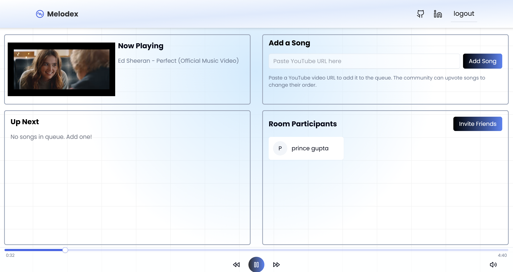

# 🎵 Melodex – Collaborative Music Rooms

Melodex is a dynamic and interactive platform where users can create or join music rooms, share YouTube tracks, and enjoy synchronized playback with friends. Whether you're hosting a party, collaborating on a playlist, or just vibing with friends, Melodex makes it easy to connect through music.

---

## 🚀 Features

- **Create and Join Rooms**: Create your own room as the creator or join an existing room as a guest.
- **Collaborative Playlists**: Add YouTube tracks to the queue and upvote favourites with the community.
- **Real-Time Sync**: Enjoy Real-time communication for participant updates, playback synchronization, and playlist changes.
- **Guest and Authenticated Access**: Secure sign-in with NextAuth (Google authentication available) and guest participation with a custom join flow.
- **Interactive Controls**: Play, pause, seek, and control volume seamlessly.
- **Invite Friends**: Share invite links to bring your friends into the room.

---

## 🛠️ Tech Stack

- **Next.js 15** – Full-stack React framework for both frontend and API routes  
- **Express.js** – Used for the separate Socket.IO server (`server.js`)  
- **Socket.IO** – Real-time communication between clients and server  
- **Prisma & PostgreSQL** – Database ORM and storage solution  
- **NextAuth.js** – Authentication solution (Google, email, etc.)  
- **Nodemailer & bcryptjs** – For email verification and secure password hashing  
- **Tailwind CSS & shadcn/ui** – Styling and pre-built UI components  
- **React Hook Form & Zod** – Form handling with schema validation  
- **next-themes** – For dark/light mode switching  
- **Sonner** – For toast notifications  
- **Axios** – For HTTP requests

---

## 📸 Screenshots

### Music Room

---

## 🎬 Watch the demo video here 👇👇

📽️ 

---